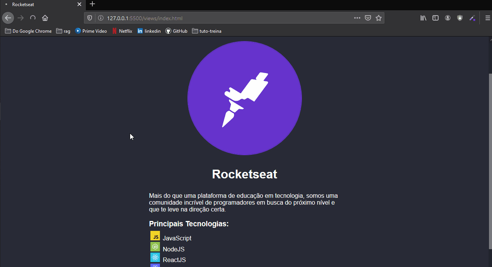

# Projeto da [Rocketseat](https://rocketseat.com.br/) - Turma LaunchBase 2020

## [Desafio 2-3](https://github.com/Rocketseat/bootcamp-launchbase-desafios-02/blob/master/desafios/02-3-pagina-cursos-e-iframe.md): Página de cursos e iframe

## O desafio teve como objetivo fortalecer os conceitos:
 - Posicionando elementos HTML com CSS grid;
 - Manipulando a DOM através do JavaScript;
 - Tag 'iframe';
 - Entre outros elementos que foram apresentado no 2º Módulo;

 ---

 ## Descrição do desafio:
Criar uma página que deve conter um grid onde devem ser mostrados os 3 principais cursos da Rocketseat. Ao clicar em um dos cursos, deve ser aberta uma modal onde um iframe irá carregar as informações do curso selecionado.

No modal deve conter o botão de fechar e de máximizar o modal, ao abrir um novo modal, este não pode abrir maximizado e sim no modo padrão.

Obs.: Esse desafio é baseado no arquivo do desafio 2-2

 ---

 ## Ilustração da aplicação:

<h1>
    
</h1>

