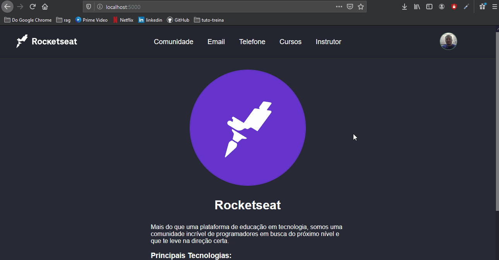

# Projeto da [Rocketseat](https://rocketseat.com.br/) - Turma LaunchBase 2020

## [Desafio 2-3](https://github.com/Rocketseat/bootcamp-launchbase-desafios-02/blob/master/desafios/02-3-pagina-cursos-e-iframe.md): Página de cursos e iframe
## [Desafio 3-1](https://github.com/Rocketseat/bootcamp-launchbase-desafios-03/blob/master/desafios/03-1-primeiro-servidor.md): Página de cursos e iframe

## O desafio atual teve como objetivo fortalecer os conceitos:
 - Página dinâmica com Nunjucks;
 - Criar um servidor;
 - Criar rotas;

 ---

 ## Descrição do desafio atual:
Criar um servidor que tenha rotas que deverão retornar o conteúdo do html gerados no desafio 2-3. Além de implementar um arquivo padrão (layout.njk) que reaproveite o código em comum entre os arquivos e também um arquivo que sirva uma página de erro 404.

Obs.: Esse desafio é baseado no arquivo do desafio 2-3

 ---

 ## Ilustração da aplicação atual:

<h1>
    
</h1>

